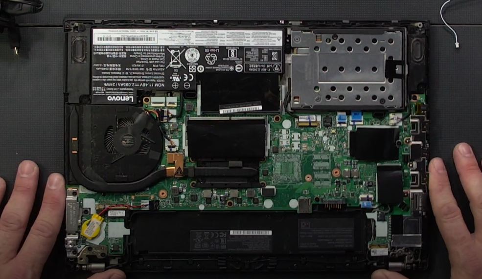
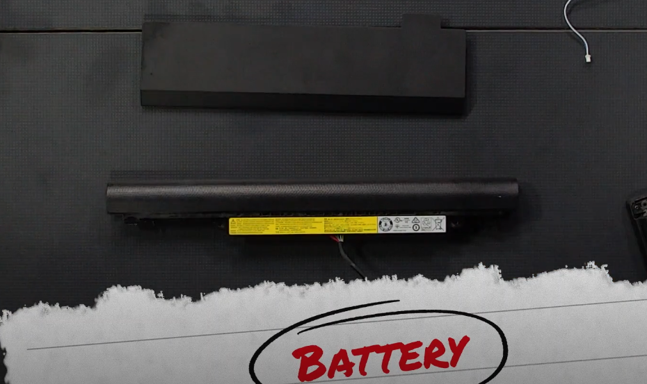
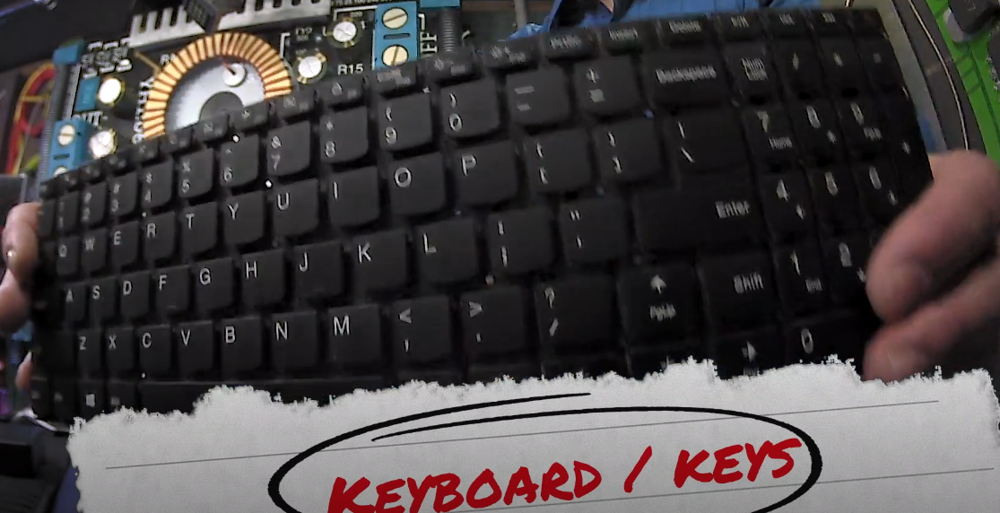
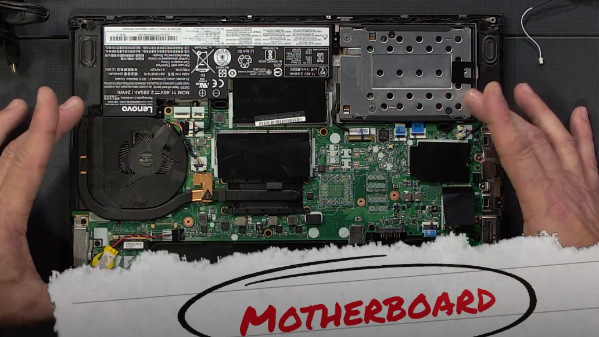
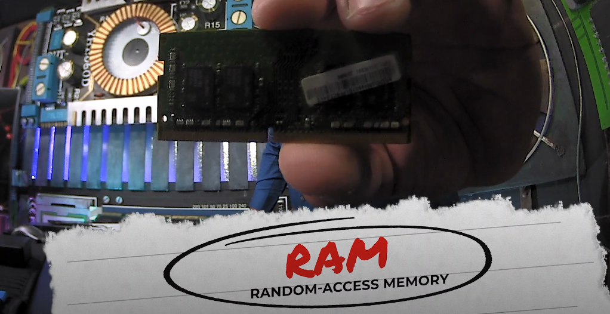
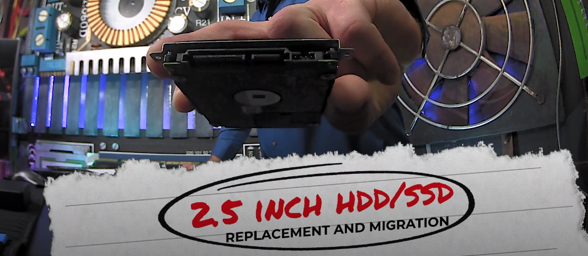
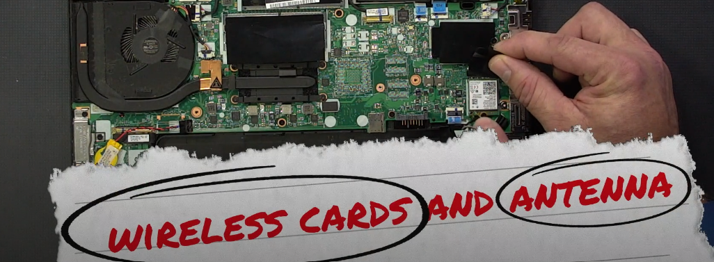
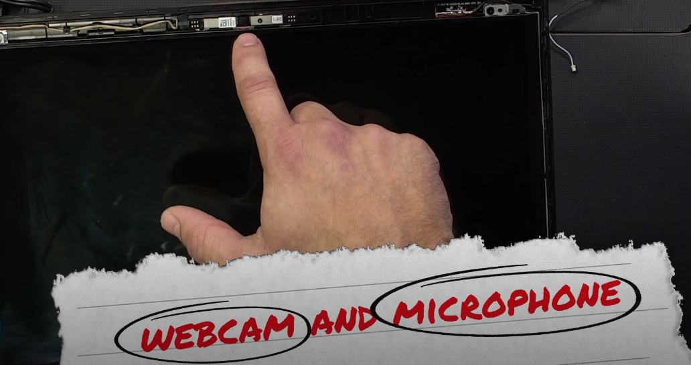
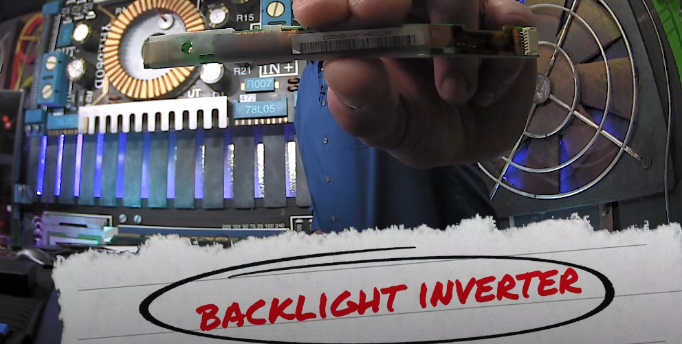

# Laptop Hardware and Components

Given a scenario, install and configure laptop hardware and components, such as hard disk drives (HDDs), solid disk drives (SSDs), webcams, wireless cards, antennas, etc. 

## Table of Contents

- [Battery](#battery)
- [Keyboard/keys](#keyboardkeys)
- [Motherboard](#motherboard)
- [RAM](#ram)
- [Disk drives](#disk-drives)
- [Wireless cards and antenna](#wireless-cards-and-antenna)
- [Webcam and microphone](#webcam-and-microphone)
- [Backlight Inverter](#backlight-inverter)
- [Additional References](#additional-references)

## Battery

Two major considerations to keep in mind are cooling and battery life for a laptop to operate.

- Nickel Cadmium ([Ni-Cd](https://www.google.com/search?q=pronunciation+nicad))
	- Obsolete, suffered from [memory effect](https://www.google.com/search?q=memory+effect+in+batteries), and too expensive to maintain.
- Nickel Metal Hydride (Ni-MH)
	- Suffered less from memory effect, required less maintenance, and have twice the charging capacity.
	- Still had memory effect and maintenance issues.
- Lithium Ion (Li-ion)
	- Much less, if none, memory effect issues, more charging capacity, and a longer battery life.
	- They ignite easily 😟🔥

Ensure that the battery types match the laptop that is being used.

## Keyboard/keys

[Laptop keyboards have a connector to the motherboard](https://youtu.be/GUzBWFqTKwM?t=193).  Be cautious as some keyboards may be part of the case (holds and protects internal components).

## Motherboard

Motherboards are extremely proprietary. Integrated or [embedded systems](https://en.wikipedia.org/wiki/Embedded_system) allow a combination of systems, CPUs, RAM, I/O devices, to be a part of a larger electronic system making it costly to replace (if damaged may have to replace all), yet efficient to use in a hardware space.

[Cooling systems](https://en.wikipedia.org/wiki/Computer_cooling) remove excessive heat from the motherboards components. The fan and thermal pipe are part of the cooling system.

## RAM

Think of [RAM](https://www.google.com/search?q=what+is+the+purpose+of+ram) as a caching layer for the hardware to fetch resources during your current session very quickly.

Be aware of the difference between static RAM([SRAM](https://en.wikipedia.org/wiki/Static_random-access_memory)) and dynamic RAM ([DRAM](https://en.wikipedia.org/wiki/Dynamic_random-access_memory)) along with the 5 types of [SDRAM](https://en.wikipedia.org/wiki/Synchronous_dynamic_random-access_memory).

## Disk drives

[SSDs](https://en.wikipedia.org/wiki/Solid-state_drive) use semiconductor cells.

[HDDs](https://en.wikipedia.org/wiki/Hard_disk_drive) are hard disk drives.

## Wireless cards and antenna

[Wireless cards](https://premioinc.com/blogs/blog/what-is-a-wireless-card-and-how-does-it-work) enable internet connection under the coverage of a wireless local area network. They transmit data through radio waves frequency wirelessly.

## Webcam and microphone

[Modern webcams and microphones are built into the laptop](https://youtu.be/-qrjiBy_SyA?t=25).

## Backlight Inverter

Backlight inverters power/illuminate the display of a monitor. They are commonly used in LCD panels. They are not needed in LED/OLED displays.

## Additional References

- [Battery](http://www.iitk.ac.in/LDP/HOWTO/Battery-Powered/battery.html)
- [Dual In-line Memory Modules](https://www.sony.com/electronics/support/articles/00031001)